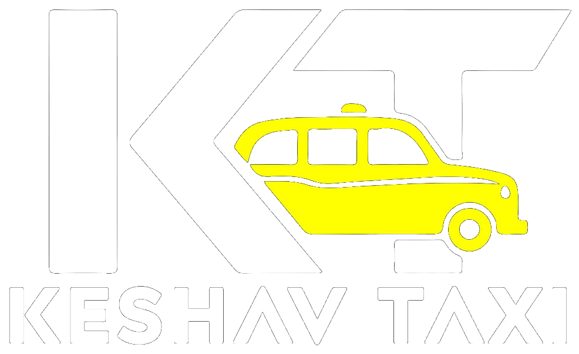

# Keshav Taxi — Website

Premium static website for **Keshav Taxi**, Jamnagar. Built for Dwarka & Somnath pilgrimage tours.

## Run it
Just open `index.html` in any browser. No build step, no dependencies — it's a pure static site (HTML + CSS + vanilla JS).

For live-reload while editing, you can use any static server, e.g.:
```
npx serve .
```

## Structure
```
cab website/
├─ index.html      → all page content
├─ css/style.css   → design system, layout, animations
├─ js/main.js      → cursor, reveals, counters, route map, WhatsApp booking
└─ assets/         → drop your logo/photos here (optional)
```

## Things you may want to update
Open `js/main.js` (top of file) and `index.html`:

| What | Where |
|------|-------|
| Phone number | `WHATSAPP_NUMBER` & `PHONE` in `js/main.js`; `tel:` + `+91 81402 30020` in `index.html` |
| Email | `booking@keshavtaxi.in` throughout `index.html` (placeholder — you sent "NEW") |
| Prices | `.pkg__price` values in the Packages section of `index.html` |
| Package/route details | Packages + Popular Routes sections |

## Use your real logo (optional)
The header uses a crafted SVG "KT" badge so the site is fully self-contained.
To use your uploaded logo image instead:
1. Save your logo as `assets/logo.png`.
2. In `index.html`, replace the `<span class="brand__badge">…</span>` SVG with:
   ```html
   
   ```

## Notes
- All "Book" / "WhatsApp" buttons open WhatsApp with a pre-filled message to `8140230020`.
- The booking form validates a 10-digit mobile before sending.
- Fully responsive, keyboard-friendly, and respects `prefers-reduced-motion`.

## Photos (fleet & tours)
Real photos now live in `assets/fleet/` and `assets/tours/`. To use **your own** pictures, just replace these files (keep the same names) — no code changes needed:

| File | Shown as | Recommended size |
|------|----------|------------------|
| `assets/fleet/dzire.jpg` | Swift Dzire | 900×600 landscape |
| `assets/fleet/ertiga.jpg` | Ertiga | 900×600 |
| `assets/fleet/innova.jpg` | Innova Crysta | 900×600 |
| `assets/fleet/tempo.jpg` | Tempo Traveller | 900×600 |
| `assets/fleet/urbania.jpg` | Urbania | 900×600 |
| `assets/tours/dwarka.jpg` | Dwarka package | 1200×675 |
| `assets/tours/somnath.jpg` | Somnath package + hero background | 1200×675 |
| `assets/tours/combo.jpg` | Combined circuit | 1200×675 |

**Licensing note:** the placeholder photos are from Wikimedia Commons under CC BY-SA and are credited in the footer. Using your **own** fleet photos is strongly recommended — it builds customer trust and lets you remove the credit line in the footer (`index.html`, `.footer__credits`).
